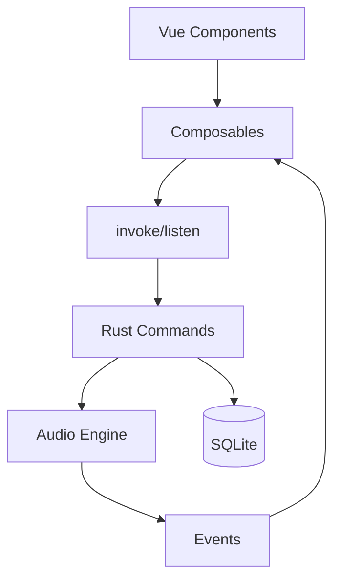

# 架构设计

## 前端结构

- **框架：** Vue 3 Composition API
- **状态管理：** Composables (usePlayer, useLibrary, useTheme)
- **UI：** Vuetify 4.0
- **构建：** Vite 6.0

## Rust 结构

- **音频引擎：** Rodio 0.19 + Symphonia
- **数据库：** SQLite (Rusqlite 0.31)
- **IPC：** Tauri Commands + Events
- **线程：** 独立进度跟踪线程

## IPC 通信方式

**前端 -> 后端：** `invoke('command', {args})`
**后端 -> 前端：** `emit('event', payload)`

## Plugin 使用

- `tauri-plugin-opener` - URL 打开
- `tauri-plugin-dialog` - 文件对话框

## 数据流

```
用户操作 -> Vue Composable -> IPC Command -> Rust Handler
Rust Handler -> IPC Event -> Vue Composable -> UI Update
```

## 架构图



## 模块职责

| 模块 | 作用 | 关键文件 |
|------|------|----------|
| 播放器 | 音频播放控制 | usePlayer.ts, audio.rs |
| 音乐库 | 歌曲和播放列表管理 | useLibrary.ts, commands/ |
| 主题 | 深色/浅色模式 | useTheme.ts |
| 数据库 | 数据持久化 | db/mod.rs, db/migrations.rs |
