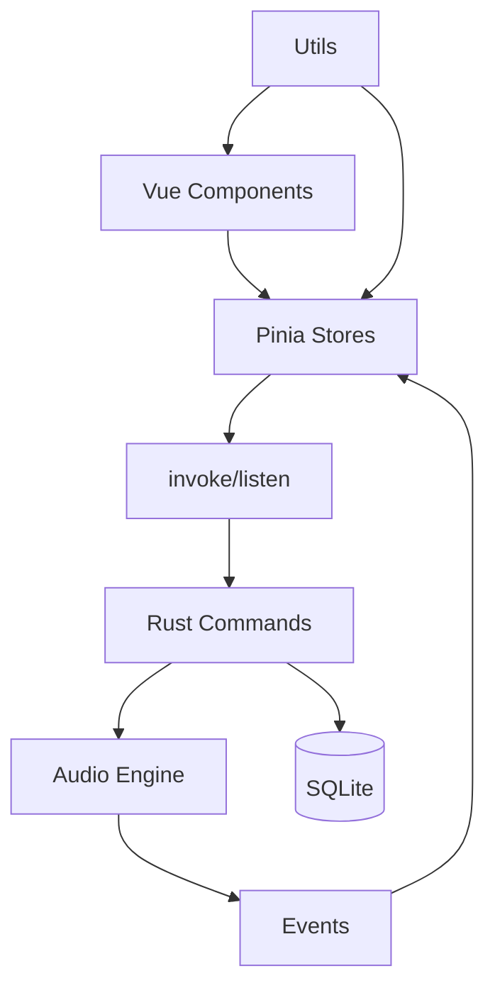

# 架构设计

## 前端结构

- **框架：** Vue 3.5 Composition API
- **状态管理：** Pinia 3.0 (stores/player.ts, stores/library.ts, stores/settings.ts)
- **UI 库：** Vuetify 4.0
- **工具库：** VueUse 14.3
- **构建：** Vite 6.0

## Rust 结构

- **音频引擎：** Rodio 0.19 + Symphonia
- **数据库：** SQLite (Rusqlite 0.31)
- **IPC：** Tauri Commands + Events
- **线程：** 独立进度跟踪线程

## IPC 通信方式

**前端 -> 后端：** `invoke('command', {args})`
**后端 -> 前端：** `emit('event', payload)`

## Plugin 使用

- `tauri-plugin-opener` - URL 打开
- `tauri-plugin-dialog` - 文件对话框

## 数据流

```
用户操作 -> Vue Component -> Pinia Store -> IPC Command -> Rust Handler
Rust Handler -> IPC Event -> Pinia Store -> UI Update
```

## 架构图



## 模块职责

| 模块 | 作用 | 关键文件 |
|------|------|----------|
| 播放器 | 音频播放控制 | stores/player.ts, audio.rs |
| 音乐库 | 歌曲和播放列表管理 | stores/library.ts, commands/ |
| 设置主题 | 深色/浅色模式 | stores/settings.ts |
| 数据库 | 数据持久化 | db/mod.rs, db/migrations.rs |
| 虚拟滚动 | 大数据性能优化 | utils/virtualScroll.ts |
| 错误处理 | 统一错误处理 | utils/errorHandler.ts |
| 类型系统 | TypeScript 类型定义 | types/index.ts |

## TypeScript 类型系统

项目使用完整的 TypeScript 类型定义：

**核心数据类型：**
- `Song` - 歌曲信息
- `Playlist` - 播放列表

**播放器类型：**
- `PlaybackMode` - 播放模式
- `PlaybackState` - 播放状态

**主题类型：**
- `ThemeColor` - 主题颜色
- `ThemeMode` - 主题模式

**视图类型：**
- `ViewMode` - 视图模式
- `DisplayMode` - 显示模式
- `SortBy` - 排序字段
- `SortOrder` - 排序顺序

**API 类型：**
- `ApiResponse<T>` - API 响应包装
- `Result<T>` - Result 类型

**音频设备类型：**
- `AudioDeviceInfo` - 音频设备信息
- `AudioDevicesResponse` - 音频设备列表响应

## 性能优化

- **虚拟滚动：** VirtualSongTable.vue 处理大量歌曲数据
- **计算属性缓存：** Pinia computed properties 避免重复计算
- **事件监听优化：** 合理管理事件监听器生命周期
- **类型安全：** 完整的 TypeScript 类型系统确保编译时错误检查
