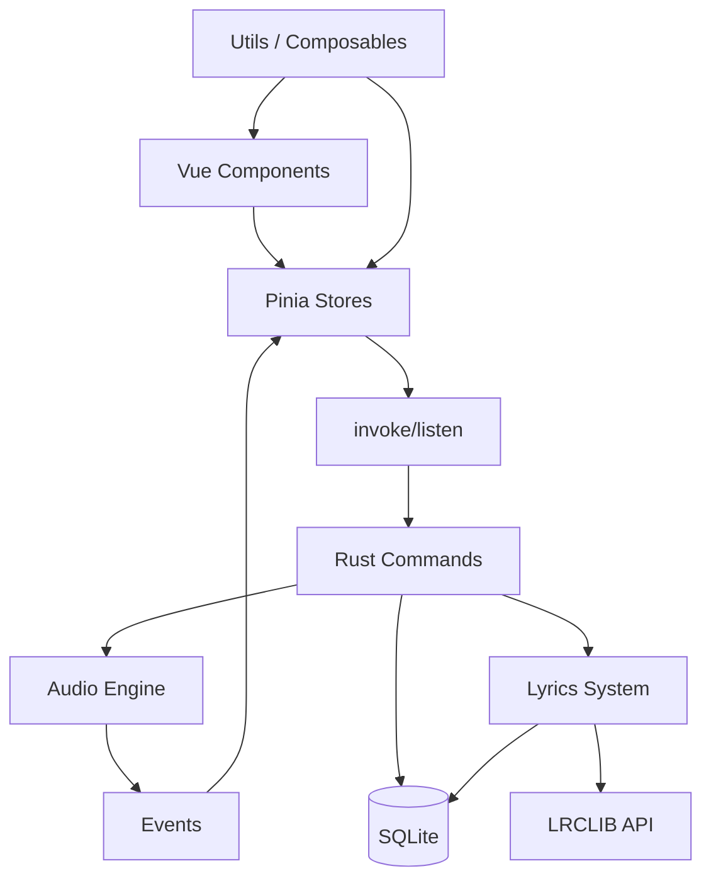

# 架构设计

## 前端结构

- **框架：** Vue 3.5 Composition API
- **状态管理：** Pinia 3.0 (stores/player.ts, stores/library.ts, stores/settings.ts)
- **UI 库：** Vuetify 4.0
- **工具库：** VueUse 14.3
- **动画：** GSAP (with Flip, ScrollTo plugins)
- **图表：** ECharts 6 + vue-echarts 8
- **构建：** Vite 6.0
- **国际化：** vue-i18n v11

## Rust 结构

- **音频引擎：** Rodio 0.19 + Symphonia
- **数据库：** SQLite (Rusqlite 0.31, WAL 模式)
- **IPC：** Tauri Commands + Events
- **线程：** 独立进度跟踪线程
- **频谱分析：** rustfft (256 点 FFT → 64 bins)
- **元数据：** Lofty (音频标签解析 + 内嵌歌词提取)
- **歌词源：** LRCLIB API (网络歌词搜索)

## IPC 通信方式

**前端 -> 后端：** `invoke('command', {args})`
**后端 -> 前端：** `emit('event', payload)`

## Plugin 使用

- `tauri-plugin-opener` - URL 打开
- `tauri-plugin-dialog` - 文件对话框
- `tauri-plugin-global-shortcut` - 系统级全局快捷键

## 全局快捷键 (Global Shortcuts)

通过 `tauri-plugin-global-shortcut` 在 OS 层注册系统级快捷键，应用未聚焦时也能触发。

**架构：** Rust 侧（`commands/shortcuts.rs`）维护「组合字符串 → action_id」反查表（`ShortcutRegistry`），OS 触发回调仅做 `app.emit("shortcut-triggered", action_id)`；前端 `useGlobalShortcuts` composable 监听该事件并按 action_id 路由到现有 stores/composables。

**默认行为：** 媒体键 Play/Pause/Next/Previous 默认开，其他 8 个动作默认关。

**存储：** 复用 SQLite `settings` 表，键名 `shortcut.<action-id>` 和 `shortcut.<action-id>.enabled`，懒写入。

**关键约束：** 主窗口必须用 `hide()` 而非 `close()`，否则 webview 销毁后 `shortcut-triggered` 事件无监听者。

## 数据流

```
用户操作 -> Vue Component -> Pinia Store -> IPC Command -> Rust Handler
Rust Handler -> IPC Event -> Pinia Store -> UI Update
```

## 窗口系统

应用包含 4 个 Tauri 窗口（在 `tauri.conf.json` 中声明），通过 `src/main.ts` 根据 `window.location.hash` 挂载不同根组件：

| Label | Hash | 根组件 | 用途 |
|-------|------|--------|------|
| `main` | (默认) | `App.vue` | 主窗口，侧边栏 + 主区域 + PlayerBar |
| `desktop-lyrics` | `#desktop-lyrics` | `DesktopLyricsApp.vue` | 桌面歌词悬浮窗口（透明、置顶、双行） |
| `desktop-lyrics-lock` | — | — | 锁定态辅助窗口（光标穿透占位） |
| `mini-player` | `#mini-player` | `MiniPlayerApp.vue` | 迷你播放器悬浮窗口，与主窗口互斥切换 |

### mini-player 窗口

**用途：** 迷你播放器悬浮窗口，与主窗口互斥切换。

**配置（`tauri.conf.json`）：**
- Label: `mini-player`
- URL: `index.html#mini-player`
- 尺寸：固定 360×100（不可调整）
- 装饰：无边框（`decorations: false`），不透明背景，系统阴影
- 默认置顶（`alwaysOnTop: true`），可通过按钮切换
- `visible: false` 初始隐藏，由 `useMiniPlayer` composable 控制

**互斥切换：** 主窗口 `main` 和迷你窗口 `mini-player` 互斥 — 进入迷你模式时主窗口完全 `hide()`，反之亦然。状态通过 `mini-player.active` settings 持久化，启动时恢复。

**触发入口：**
- PlayerBar 上的迷你模式按钮
- Cmd/Ctrl+M 快捷键
- 系统最小化按钮（拦截为进入迷你模式）

## 启动数据流

```
App.vue onMounted
  -> useLibraryStore.loadFromDb()
  -> invokeCommand('get_bootstrap_data')   # 单次 IPC 获取全部数据
  -> 返回 { songs, playlists, playlistSongs, settings }
  -> Store 状态初始化
```

## 架构图



## 模块职责

| 模块 | 作用 | 关键文件 |
|------|------|----------|
| 播放器 | 音频播放控制 | stores/player.ts, audio/ |
| 音乐库 | 歌曲和播放列表管理 | stores/library.ts, commands/ |
| 设置主题 | 深色/浅色模式 + 主题颜色 | stores/settings.ts |
| 歌词 | LRC 解析 + 同步显示 | composables/useLyrics.ts, commands/lyrics.rs, LyricsDisplay.vue |
| 桌面歌词窗口 | 悬浮透明歌词 | composables/useDesktopLyrics.ts, components/desktop-lyrics/ |
| 迷你播放器窗口 | 悬浮迷你模式（与主窗口互斥） | composables/useMiniPlayer.ts, mini-player/ |
| 曲库分析 | 音乐库统计图表 | AnalysisView.vue, commands/stats.rs |
| 音频可视化 | FFT 频谱渲染 | visualization/, analyzer.rs |
| 启动加载 | 单次批量数据获取 | commands/bootstrap.rs |
| 数据库 | 数据持久化 | db/mod.rs, db/migrations.rs |
| 虚拟滚动 | 大数据性能优化 | utils/virtualScroll.ts |
| 错误处理 | 统一错误处理 | utils/errorHandler.ts |
| 类型系统 | TypeScript 类型定义 | types/index.ts |

## TypeScript 类型系统

项目使用完整的 TypeScript 类型定义：

**核心数据类型：**
- `Song` - 歌曲信息 (id, title, artist, album, duration, durationSecs, quality, filePath, artGradient, genre, fileSize)
- `Playlist` - 播放列表

**播放器类型：**
- `PlaybackMode` - 播放模式 (sequential/repeat_all/repeat_one/shuffle)
- `PlaybackState` - 播放状态

**主题类型：**
- `ThemeColor` - 主题颜色
- `ThemeMode` - 主题模式 (light/dark/system)

**视图类型：**
- `ViewMode` - 视图模式
- `DisplayMode` - 显示模式 (songs/albums/artists)
- `SortBy` - 排序字段
- `SortOrder` - 排序顺序

**歌词类型：**
- `LrcLine` - 歌词行 (time + text)

**API 类型：**
- `ApiResponse<T>` - API 响应包装
- `Result<T>` - Result 类型

**音频设备类型：**
- `AudioDeviceInfo` - 音频设备信息
- `AudioDevicesResponse` - 音频设备列表响应

**曲库分析类型：**
- `LibraryStats` - 聚合统计（总量 + 艺术家/专辑排行 + 流派/音质/时长分布）
- `ArtistCount`, `AlbumCount`, `GenreCount`, `QualityCount`, `DurationBucket` - 各分布项

## 性能优化

- **Bootstrap 启动：** `get_bootstrap_data` 单次 IPC 加载全部应用数据
- **虚拟滚动：** VirtualSongTable.vue 处理大量歌曲数据
- **防抖搜索：** useDebounceSearch 300ms 防抖，减少计算频率
- **排序缓存：** useOptimizedSort 缓存排序结果
- **懒加载图片：** useLazyImages IntersectionObserver 按需加载
- **计算属性缓存：** Pinia computed properties 避免重复计算
- **事件监听优化：** 合理管理事件监听器生命周期
- **类型安全：** 完整的 TypeScript 类型系统确保编译时错误检查
- **WAL 模式：** SQLite WAL 模式提升并发读写性能
