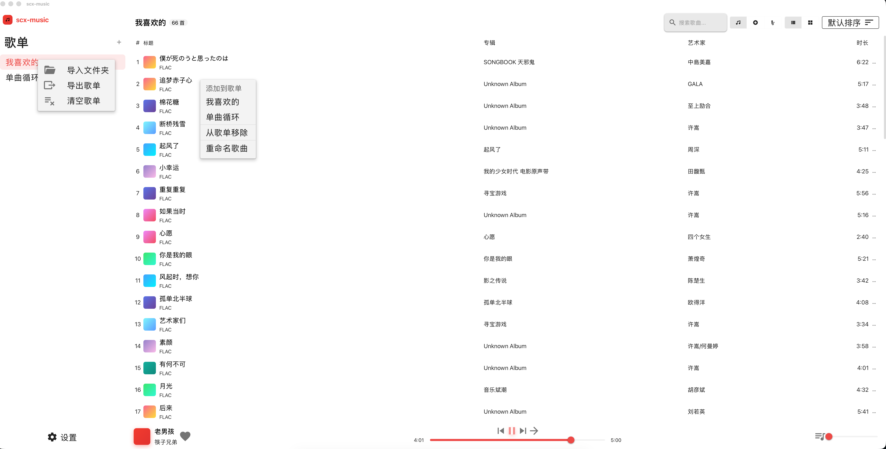
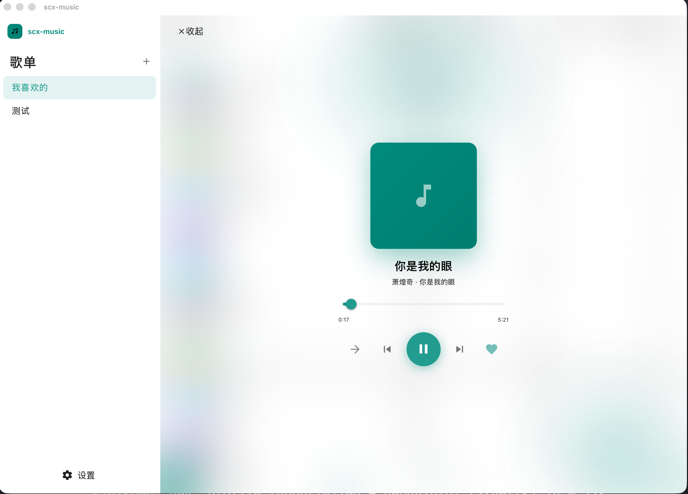
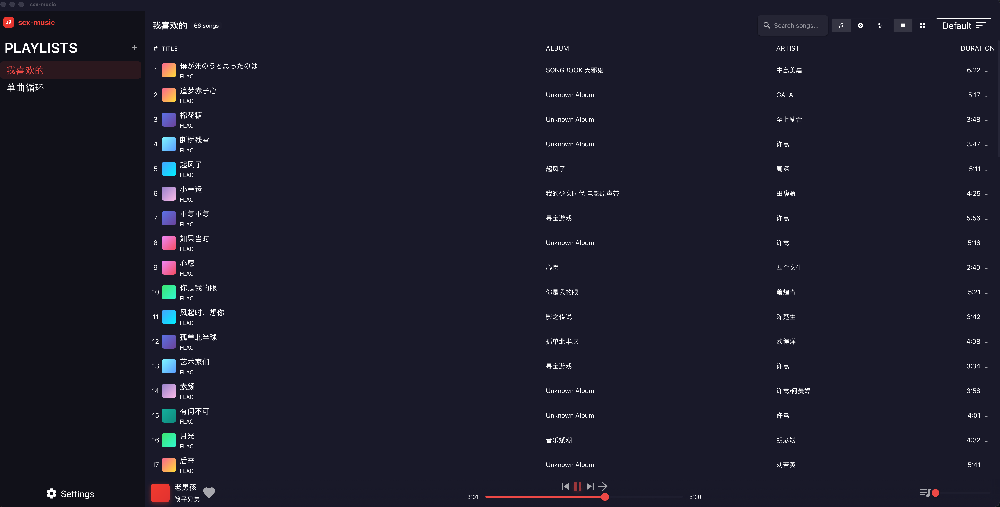
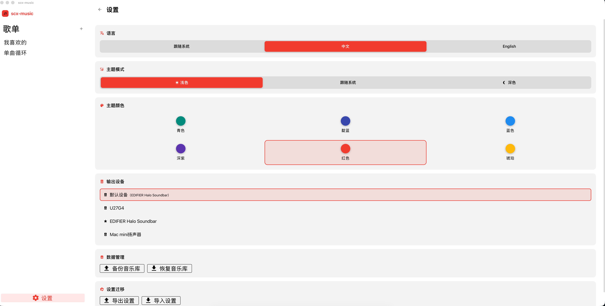

# scx-music

**本地音乐播放器桌面应用**

一款简洁优雅的本地音乐播放器，支持多种播放模式。

[功能特性](#功能特性) • [快速开始](#快速开始) • [技术栈](#技术栈) • [开发指南](#开发指南)

---

## 预览

### 主界面



### 播放控制



### 夜间模式



### 设置界面



---

## 功能特性

- **本地音乐库管理** — 支持导入本地音乐文件夹，自动扫描音频文件并提取元数据
- **播放控制** — 播放/暂停、上一曲/下一曲、进度拖拽、音量调节、输出设备切换
- **多种播放模式** — 顺序播放、单曲循环、列表循环、随机播放
- **歌词显示** — 支持内嵌歌词和在线歌词 (LRCLIB)，同步滚动，点击跳转
- **音频可视化** — 频谱柱状图、环形放射、流动波形、粒子系统四种风格
- **主题定制** — 支持 6 种主题颜色 + 亮色/暗色/跟随系统三种模式
- **国际化** — 支持中文/英文，自动检测系统语言
- **设置持久化** — 用户设置自动保存（基于 Rust 后端 + SQLite）

---

## 技术栈

### 前端
- **框架** — Vue 3 (Composition API + `<script setup>`)
- **语言** — TypeScript
- **构建工具** — Vite
- **UI 组件库** — Vuetify 4.0
- **状态管理** — Pinia
- **工具库** — VueUse

### 后端
- **桌面框架** — Tauri v2
- **系统语言** — Rust

---

## 快速开始

### 环境要求

- **Node.js** >= 18
- **pnpm** >= 8
- **Rust** (用于构建 Tauri 后端)

### 安装依赖

```bash
pnpm install
```

### 开发模式

```bash
pnpm app:dev
```

### 生产构建

```bash
pnpm app:build
```

构建产物位于 `src-tauri/target/release/bundle/` 目录。

---

## 开发指南

### 项目结构

```
scx-music/
├── src/                    # Vue 前端源码
│   ├── components/         # Vue 组件
│   ├── composables/        # 组合式函数
│   ├── stores/             # Pinia 状态管理
│   ├── types/              # TypeScript 类型定义
│   ├── utils/              # 工具函数
│   └── constants/          # 常量配置
├── src-tauri/              # Rust 后端源码
│   ├── src/                # Rust 源码
│   └── tauri.conf.json     # Tauri 配置
├── .wiki/                  # 项目文档
├── docs/                   # 文档资源（截图等）
└── CLAUDE.md               # AI 辅助开发指南
```

### 开发命令

| 命令 | 说明 |
|------|------|
| `pnpm dev` | 仅启动 Vite 开发服务器 |
| `pnpm build` | 仅构建前端 |
| `pnpm app:dev` | Tauri 开发模式（前端+后端热重载） |
| `pnpm app:build` | 生产构建（打包桌面应用） |

## Wiki

本项目维护了详细的开发文档，位于 [`.wiki/`](.wiki/) 目录：

- [架构概览](.wiki/architecture.md) — Tauri 双进程架构说明
- [前端开发](.wiki/frontend.md) — Vue 组件与状态管理
- [后端开发](.wiki/backend.md) — Rust 命令与 IPC 通信
- [IPC 通信](.wiki/ipc.md) — 前后端 IPC 调用映射
- [数据存储](.wiki/storage.md) — SQLite 数据库设计
- [AI 快速上下文](.wiki/ai-context.md) — AI 辅助开发快速入口

---

## 许可证

[MIT](LICENSE)
